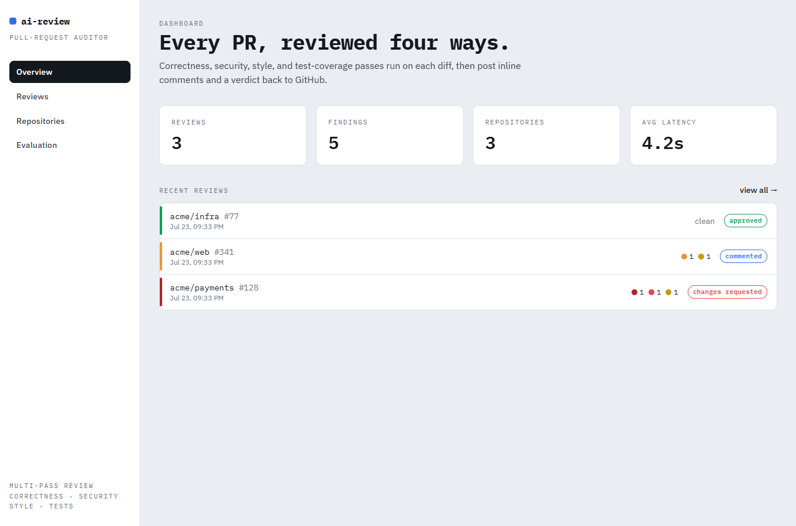
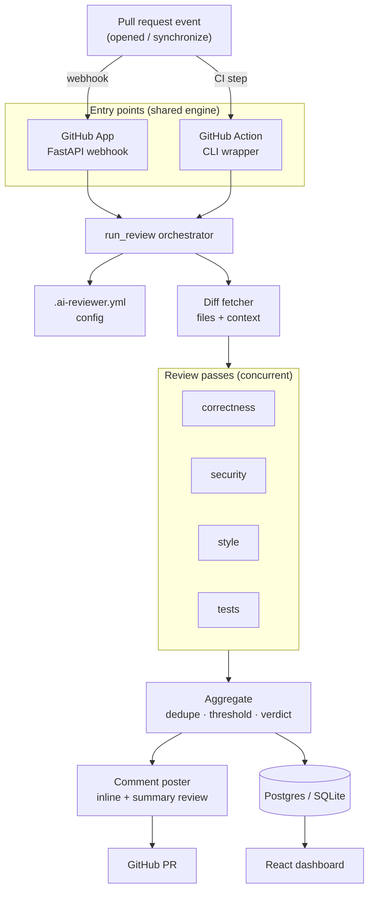
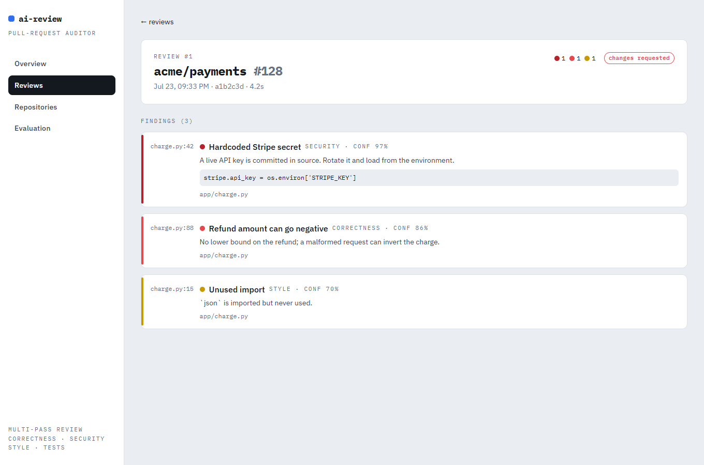

# AI GitHub PR Reviewer

Automated, multi-pass AI review for pull requests. On every new PR (or new
commits), it fetches the diff plus surrounding file context, runs four focused
review passes — **correctness, security, style, and test coverage** — then posts
inline comments on the exact lines plus a summary review with an overall verdict
(approve / comment / request changes). Configurable per repository, logged to a
database, and shipped with a dashboard, an evaluation harness, and one-click
deploy.

Runs two ways from a single shared engine: a **GitHub App** (webhook bot, the
real product) and a **GitHub Action** (drop-in CI step, easiest to demo).



## Contents

- [Architecture](#architecture)
- [Features](#features)
- [Quick start (local)](#quick-start-local)
- [Configuration](#configuration-ai-revieweryml)
- [Install as a GitHub Action](#install-as-a-github-action)
- [Register as a GitHub App](#register-as-a-github-app)
- [Environment variables](#environment-variables)
- [Evaluation](#evaluation)
- [Testing](#testing)
- [Deploy](#deploy)
- [Project structure](#project-structure)
- [License](#license)

## Architecture



The diff fetcher pulls per-file patches, parses them into line/position maps (so
inline comments land on valid lines), and gathers surrounding file content for
the model. Each pass returns structured findings `(file, line, severity,
pass_type, message, suggestion, confidence)`; the aggregator drops
low-confidence and out-of-diff findings, dedupes, and computes the verdict from
the configured severity threshold.

## Features

- **Multi-pass review** — separate, focused prompts per concern beat one giant prompt.
- **Inline + summary** — comments on exact lines (with GitHub `suggestion` blocks) plus an aggregated verdict.
- **Provider-agnostic LLM** — OpenAI by default, Anthropic Claude swappable via config or env.
- **Per-repo config** — enable/disable passes, set the blocking severity, ignore paths, cap PR size.
- **Two integrations, one engine** — GitHub App (webhook) and GitHub Action (CI) share all logic.
- **Persistence + dashboard** — every review logged; a React dashboard shows reviews, findings, repos, and eval runs.
- **Evaluation harness** — synthetic benchmark with injected bugs measuring recall, precision, and latency.
- **Deploy-ready** — multi-stage Docker image, docker-compose, and a Render blueprint.

## Quick start (local)

Requires Python 3.12 and Node 20+.

```bash
# 1. Backend
python -m venv .venv
. .venv/Scripts/activate          # Windows;  source .venv/bin/activate on Unix
pip install -e ".[dev]"
cp .env.example .env              # fill in OPENAI_API_KEY / GITHUB_TOKEN as needed
alembic upgrade head              # create tables (SQLite by default)
uvicorn app.main:app --reload     # http://localhost:8000  (API + /docs)

# 2. Dashboard (separate terminal)
cd frontend
npm install
npm run dev                       # http://localhost:5173  (proxies /api to :8000)
```

Or run the whole stack (API + Postgres) with Docker:

```bash
docker compose up --build         # API on http://localhost:8000
```

## Configuration (`.ai-reviewer.yml`)

Drop this file at the root of any repository the reviewer runs on. All keys are
optional; omitted keys use the defaults shown.

```yaml
passes:
  correctness: true
  security: true
  style: true
  tests: true
block_severity: high        # findings >= this -> "request changes"
min_confidence: 0.6         # drop findings the model is less sure about
ignore_paths:
  - "**/*.lock"
  - "dist/**"
  - "vendor/**"
max_files: 50               # skip review if a PR touches more files
llm:
  provider: openai          # openai | anthropic
  model: gpt-4o             # e.g. gpt-4o, claude-opus-4-8
```

## Install as a GitHub Action

The simplest way to try it. Copy [`examples/ai-review.yml`](examples/ai-review.yml)
to `.github/workflows/ai-review.yml` in the target repo and add an
`OPENAI_API_KEY` secret:

```yaml
name: AI PR Review
on:
  pull_request:
    types: [opened, synchronize, reopened]
permissions:
  contents: read
  pull-requests: write
jobs:
  review:
    runs-on: ubuntu-latest
    steps:
      - uses: actions/checkout@v4
      - uses: Khayal07/ai-github-reviewer/action@main
        with:
          github-token: ${{ secrets.GITHUB_TOKEN }}
          openai-api-key: ${{ secrets.OPENAI_API_KEY }}
```

The Action exits non-zero when the verdict is *request changes*, so it can gate
a required check.

## Register as a GitHub App

The "real product" path — reviews every PR with no per-repo workflow file.

1. **GitHub → Settings → Developer settings → GitHub Apps → New GitHub App.**
2. **Webhook URL:** `https://<your-host>/webhook`; set a **Webhook secret**.
3. **Permissions:** Pull requests → *Read & write*; Contents → *Read-only*.
   **Subscribe to events:** *Pull request*.
4. Generate a **private key** (`.pem`) and note the **App ID**.
5. Put the App ID, webhook secret, and private key in your environment
   (`GITHUB_APP_ID`, `GITHUB_WEBHOOK_SECRET`, `GITHUB_APP_PRIVATE_KEY` or
   `GITHUB_APP_PRIVATE_KEY_PATH`) and deploy (see [Deploy](#deploy)).
6. **Install** the App on a repository. New PRs are now reviewed automatically.

The webhook verifies GitHub's HMAC signature, acknowledges immediately, and runs
the review in the background, minting a short-lived installation token per event.

See [`docs/example-review.md`](docs/example-review.md) for a mock of the posted
output, and here's the dashboard review detail:



## Environment variables

Copy `.env.example` to `.env`. Key settings:

| Variable | Purpose |
| --- | --- |
| `DATABASE_URL` | `sqlite:///./ai_reviewer.db` locally; a Postgres URL in prod. |
| `LLM_PROVIDER` / `LLM_MODEL` | Default provider (`openai`/`anthropic`) and model. |
| `OPENAI_API_KEY` / `ANTHROPIC_API_KEY` | LLM credentials. |
| `GITHUB_TOKEN` | PAT for the Action / manual runs. |
| `GITHUB_APP_ID`, `GITHUB_WEBHOOK_SECRET`, `GITHUB_APP_PRIVATE_KEY[_PATH]` | GitHub App (webhook bot). |

`.env` is gitignored; only `.env.example` (placeholders) is committed.

## Evaluation

A small benchmark of synthetic PRs with known injected issues (and a clean
control) lives in `eval/benchmark/`. Score the reviewer and write a report:

```bash
python -m eval.run_eval                       # offline heuristic baseline (no keys)
python -m eval.run_eval --provider openai --model gpt-4o   # score the real model
```

It measures **recall** (injected issues caught), **precision** (findings on
clean code that are false positives), per-pass breakdown, and latency, writing
`eval/reports/report.md` + `report.json` and logging an `EvalRun` surfaced on the
dashboard's Evaluation page.

## Testing

```bash
pytest            # unit + integration; no live API keys needed
```

- **Unit** — diff parser (line/position mapping), finding→comment mapping, config parsing, verdict/dedupe logic, eval scoring.
- **Integration** — a full review cycle against a mocked GitHub API (`respx`) with a stubbed LLM, plus webhook signature/routing and DB logging.

## Deploy

**Docker (any host):**

```bash
docker build -t ai-reviewer .
docker run -p 8000:8000 --env-file .env ai-reviewer
```

The multi-stage image builds the dashboard and serves it from FastAPI, runs
Alembic migrations on start, and binds to `$PORT`.

**Render (one click):** [`render.yaml`](render.yaml) provisions the web service
and a managed Postgres. After the first deploy, set the `sync: false` secrets
(`OPENAI_API_KEY`, GitHub App keys) in the dashboard.

## Project structure

```
app/            FastAPI backend
  github/       App auth, REST client, diff parser, comment poster
  review/       findings schema, LLM clients, passes, engine, context
  api/          dashboard JSON API
  webhook.py    pull_request event handler
  reviewer.py   shared run_review orchestrator
  store.py      DB persistence
action/         GitHub Action wrapper (action.yml + entrypoint.py)
frontend/       React + Vite + Tailwind dashboard
eval/           benchmark cases, heuristic baseline, metrics, runner
tests/          unit + integration tests
```

## License

MIT — see [LICENSE](LICENSE).
